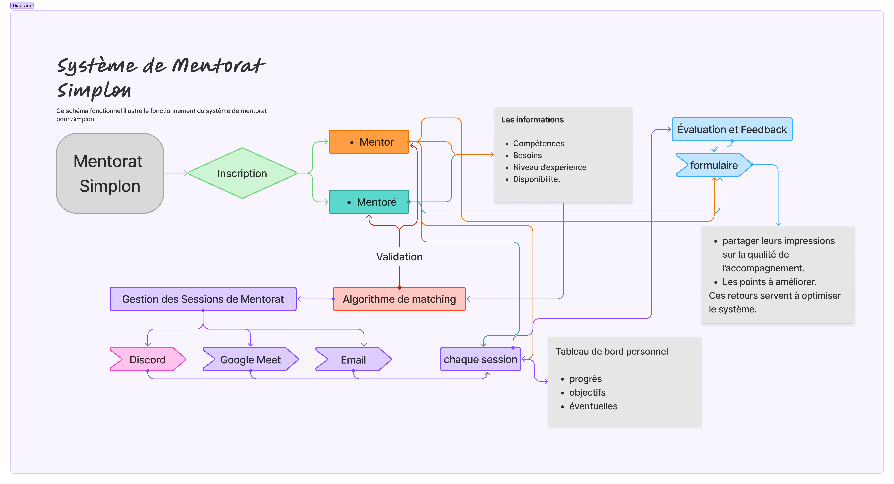

# Système de Mentorat Simplon

## Introduction
Le système de mentorat pour Simplon est une plateforme permettant de mettre en relation des mentors et des mentorés afin de faciliter l'apprentissage, le partage d'expérience et l'orientation professionnelle. L'outil principal pour les échanges est **Discord**, mais d'autres canaux comme **Google Meet** et **Email** sont également pris en charge.

## Fonctionnalités principales
### 1. Inscription et Appariement
- Les utilisateurs s'inscrivent en tant que **mentor** ou **mentoré**.
- Un algorithme de **matching** associe les mentors aux mentorés en fonction des critères suivants :
  - Formation suivie
  - Compétences techniques et soft skills
  - Disponibilité
  - Localisation (optionnelle)

### 2. Gestion des Sessions de Mentorat
- Sessions organisées sur **Discord** avec possibilité d'utiliser **Google Meet ou Email**.
- Tableau de bord personnel pour planifier et suivre les sessions.
- Prise de notes et suivi des objectifs pour chaque session.

### 3. Feedback et Évaluation
- Formulaires de feedback après chaque session.
- Système de notation pour améliorer l'expérience utilisateur.
- Suivi et analyse des données pour optimiser le programme.

### 4. Support et Formation
- Guides d'utilisation de **Discord**.
- Ateliers de formation pour les mentors.
- Communication via email et événements en présentiel.

